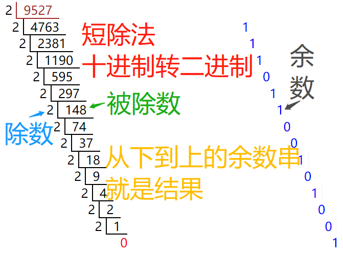

# 数字
## 平时最常用的是啥数字？阿拉伯数字，如“9527”（读作“九千五百二十七”）。
### 如果读作“九五二七”，就不够严谨！

# 进制
## 刚才说的数字，是啥进制？十进制，因为求和的时候要“逢十进一”、进行做差的时候要“借一抵十”。
### 没错，现在就一定要像幼儿园朋友一样，掰开手指、拿出纸笔，重新认识最基本的数学知识。

# 再看十进制数
## 回想“[起步](./起步.md)”中提到的“文字符号”的含义，那么阿拉伯数字也是一种“文字符号”，用在“数学语言”中。
## 就要问“阿拉伯数字”有多少个“文字符号”？当然是十个，即“0”、“1”、“2”、“3”、“4”、“5”、“6”、“7”、“8”、“9”。
### 因为任何阿拉伯数字，再大再小，都要由者十个符号来表示。
## 要记住**零（0）也是不可或缺的一个数**。
### 现在自然数包括零（0）！
### *参考一九九三年颁布的《中华人民共和国国家标准》（GB 3100～3102-1993）《量和单位》（11-2.9）第311页*。
### 问眼前有几个美女、几个帅哥。没有就是零（0）个，是不是数地很自然。

# 位置决定价值
## 一起看“1314”（读作“一千三百一十四”）这个数。
## 大家知道，正如严谨读法那样——
### 从右到左，从低位到高位，用自然数编号，分别是：
#### 第0位的“4”、第“1”位的“1”、第“2”位的“3”，第“3”位的“1”。
### 第“3”位的单位读作“千”，就是“1000”，即“10*10*10”，也就是“十的三次方”。
### 第“2”位的单位读作“百”，就是“100”，即“10*10”，也就是“十的二次方”。
### 第“1”位的单位读作“十”，就是“10”，即“10”，也就是“十的一次方”。
### 第“0”位的单位读作“个”，就是“1”，也就是“十的零次方”。
### 这个“1314”不就是“1个1000加上3个100加上1个10加上4个1”么！
#### 1314 = 1*1000 + 3*100 + 1*10 + 4*1
#### 假设用“^”表示乘方，即“x^y”表示“x的y次方”。
#### 1314 = 1*10^3 + 3*10^2 + 1*10^1 + 4*10^0
### 也就是说，这个数的值等于“每个位乘以这个位对应的权值然后累加起来”，称作“**加权求和**”。
### 同样的符号“1”处在不同的位置，单位就不一样，叫作“权值”。
### 有没有发现**每位对应的权值等于“‘进制’的‘位号’次方”**！

# *截至目前，上述任何一句话还有疑问，就继续思考，直到理解了再继续。*

# 自此，骚年发现了“数字进制”的秘密。
# 脑洞大开，除了十进制，是不是可以有别的进制！
## 如果自发此问，说明很有天分；
## 如果恍然大悟，说明孺子可教；
## 如果一头雾水，说明到此为止。

# 当然有了！
## 可能骚年心中各种奇葩进制如弹幕般飘过……
## 首先介绍“二进制”。

# 二进制
## 的确很二，二得只有“0”和“1”这么两个符号那么简单。
## 不要紧张，感觉迷糊就对照十进制。
## 例如“1010”（读作“一零一零”——这回就这么读）这个二进制数：
### 同理，从右到左，从低位到高位，用自然数编号，分别是：
#### 第0位的“0”、第“1”位的“1”、第“2”位的“0”、第“3”位的“1”。
### 同理，**每位对应的权值等于“‘进制’的‘位号’次方”**！
#### 第0位表示“2^0”，等于“0”；
#### 第1位表示“2^1”，等于“2”；
#### 第2位表示“2^2”，即“2*2”，等于“4”；
#### 第3位表示“2^3”，即“2*2*2”，等于“8”。
### 那么，这个二进制数的值，用**加权求和**方式计算：
#### 1*2^3 + 0*2^2 + 1*2^1 + 0*2^0 = 8 + 0 + 2 + 0 = 10
### 这样就把二进制数转换位等价的十进制数了。

# 别着急地往下翻，自己多练习一些二进制数转换为对应的十进制数。

# 骚年顺势考虑“十进制数如何转为二进制数”。
## 下来介绍一种利器，短除法。

# 短除法
## 几乎专为“十进制转二进制”而生的。
## 
### 看到了吧，就是：
#### 原十进制数除以二（左边）得到商（下边）和余数（右下边）；
#### 继续对商除以二，直到商为一。
#### 以最后的商（一定是一）开始，紧接从下到上的余数，形成对应的二进制数。

# 随便选一些十进制数试试。

# 验证
## 如上图所示，十进制数“9527”对应的二进制数是“10010100110111”。
## 根据上述加权求和方法，很容易得出二进制数“10010100110111”对应的十进制数：
### 给“10010100110111”从最低位（LSB）到最高位（MSB）按自然数编号：
#### 第0位是“1”；
#### ……
#### 第13位是“1”。
#### 1*2^13 + 1*2^10 + 1*2^8 + 1*2^5 + 1*2^4 + 1*2^2 + 1*2^1 + 1*2^0
#### 8192 + 1024 + 256 + 32 + 16 + 4 + 2 + 1
#### 不多不少，刚刚好“9527”。

# 现在，骚年不仅活在十进制世界里，而且已经踏进二进制世界。
## 欢迎来到**数字信息化时代**！

# 二进制书写起来太长啦！
## 骚年站在门口抱怨道。
## 假装只为解决这个问题，引入八进制和十六进制。

# 八进制
## 很好，骚年已经径直反应，只用到“0”、“1”、“2”、“3”、“4”、“5”、“6”、“7”这八个阿拉伯数字符号。
## 刚好对应二进制数的“0”、“1”、“10”、“11”、“100”、“101”、“110”、“111”。
### 嗯，最多三位二进制数。
### 那么**一个八进制数的每一位，可直接转为三位二进制数，拼起来就是该八进制数的二进制数**！
## 例如“731”这个鬼八进制数：
### “7”表示为“111”；
### “3”表示为“011”；
### “1”表示为“001”；
## 拼起来就是“111011001”。
## 可以把各进制的表示通过加权求和方法计算出十进制的表示：
### 二进制“111011001”等于“1*2^8 + 1*2^7 + 1*2^6 + 1*2^4 + 1*2^3 + 1*2^0”等于“256 + 128 + 64 + 16 + 8 + 1”等于十进制“473”。
### 八进制“731”等于“7*8^2 + 3*8^1 + 1*8^0”等于“448 + 24 + 1”等于十进制“473”。
## 所以，八进制的“731”等价于二进制的“111011001”等价于十进制的“473”。
## 再次强调：**价值不会因为进制（表现形式）而变化**！
## 反过来，一个二进制数如何转为对应的八进制数呢？
### 从最低位到最高位，每三位分一组，不足三位的给前边补零，每组的二进制片段计算出对应的八进制数，拼起来即可。
## 例如“10100100010”这串二进制数：
### 最低的三位是“010”，对应的八进制数是“2”；
### 紧临的三位是“100”，对应的八进制数是“4”；
### 再前的三位是“100”，对应的八进制数是“4”；
### 最高的三位是“010”，对应的八进制数是“2”；
## 因此二进制数“10100100010”对应的八进制数是“2442”。
## 两者都对应十进制数“1314”，自己验证下。

# 十六进制
## 因为阿拉伯数字只有十个符号（“0”、“1”、“2”、“3”、“4”、“5”、“6”、“7”、“8”、“9”），不够用；
## 因此从英文字母（不区分大小写）中借来“A”、“B”、“C”、“D”、“E”、“F”来表示值“10”、“11”、“12”、“13”、“14”、“15”。
### 一起构成十六进制的十六个符号。
### 为啥不直接用“10”到“15”？
### 问的好！如果用“10”到“15”，假定有个十六进制数“11011”，这究竟是“11 0 11”还是“1 10 1 1”？
#### 本质是因为“10”到“15”属于十进制符号的组合。
## 一个十六进制符号对应四个二进制位，因为四位二进制数最大可表示到“1111”即“8+4+2+1”即“15”即“F”。
### 十六进制 -- 二进制
### 0           0000
### 1           0001
### 2           0010
### 3           0011
### 4           0100
### 5           0101
### 6           0110
### 7           0111
### 8           1000
### 9           1001
### A           1010
### B           1011
### C           1100
### D           1101
### E           1110
### F           1111
## 上述对照表，如同九九乘法口诀一样，不仅要知道其中的道理，最好能滚瓜烂熟。
### 因为很多场合都会用到十六进制，因为它：
#### 不长不短；
#### 既大幅度降低二进制书写麻烦、又保持较少的符号数量；
#### 快速心算式地和二进制互转。

# 二进制作为各种进制间转换的桥梁，屡试不爽。
## 也就是说十进制转八进制、十六进制，则先把十进制转为二进制，然后把二进制转为八进制、十六进制；反之亦然。
## 这个自行演练，多多益善！
