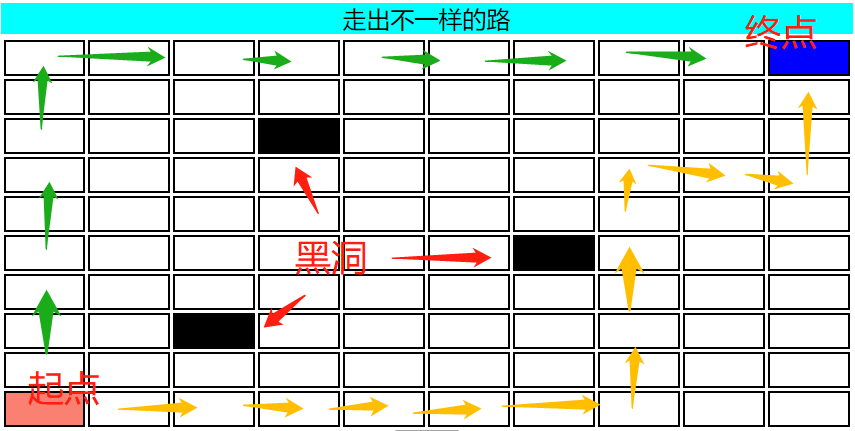
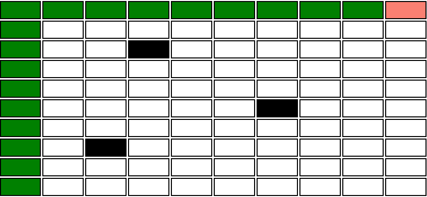
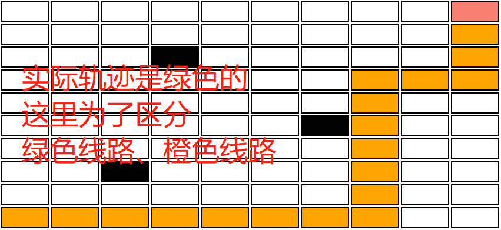

# 流程
## 就是说话办事的步骤。
### 最基本的是顺序执行：把大象装冰箱，首先打开冰箱盖、接着把大象放进去、最后关闭冰箱盖。
### 仅接着的是条件分支：要是有钱就买房买车、没钱就砸锅卖铁。
### 较复杂的是循环迭代：“月明星稀，乌鹊南飞。绕树三匝，何枝可依？”

# 控制
## 就是通过指令（命令）指挥（引导）说话办事的进行。
### 这其实就是第三人称（面向过程）编程主要活动。

# 一起玩个游戏
## 给一个丛横交错的地图、一辆小车，让小车从【左下角】行驶到【右上角】。
### 有四个用来操作小车的“函数”，就是指令（命令）：
#### LEFT，控制小车向左行进一个单位的距离；
#### RIGHT，控制小车向右行进一个单位的距离；
#### UP，控制小车向上行进一个单位的距离；
#### DOWN，控制小车向下行进一个单位的距离。
## 向着目标，留下妖娆的轨迹吧！
## [点击开始游戏](./cargame.html)

# 指令
## 机器天生支持的动作。
### 如“小车游戏”中小车所支持的“上下左右”一个单元格子的移动。

# 设计
## 说话办事前的思考，设定不同的场景做出对应的规划。
### 
#### 为了避开黑洞，顺利地从起点到终点，目前选择了两条线路：绿色线路、橙色线路。

# 实现
## 在设计思路地指导下，运用恰当的手段将图纸变成现实。
## 绿色线路
### UP
### UP
### UP
### UP
### UP
### UP
### UP
### UP
### UP
### RIGHT
### RIGHT
### RIGHT
### RIGHT
### RIGHT
### RIGHT
### RIGHT
### RIGHT
### RIGHT
#### 就是先向上移动九个单元格子，后向右移动九个单元格子。
#### 
## 橙色线路
### RIGHT
### RIGHT
### RIGHT
### RIGHT
### RIGHT
### RIGHT
### RIGHT
### UP
### UP
### UP
### UP
### UP
### UP
### RIGHT
### RIGHT
### UP
### UP
### UP
#### 就是：
##### 首先向右移动七个单元格子；
##### 然后向上移动六个单元格子；
##### 接着向右移动两个单元格子；
##### 最后向上移动三个单元格子。
#### 

# 顺序结构
## 类似上述逐步地、各步间没有包含关系地动作，称作“顺序执行”。

# 循环结构
## 江胡传言“懒人是技术的推动者”。
### 勤劳如卿，不感觉把同一个指令重复写多次很烦人么？
## 引入一个“REPEAT 指令 N”语法表示将“指令”重复做N次，其中N是自然数。
## 据此，一起来改写上述冗长的指令序列：
### REPEAT UP 9
### REPEAT RIGHT 9
## 顿时神清气爽，有木有！
## 只要认识单词“REPEAT”和“UP/RIGHT”以及阿拉伯数字“9”是不是很好领会这两句改进版指令的含义呢！
## 重复做N次，就是循环干N遍；这种把“同一组动作序列”连续执行多次的动作，称作“循环执行”。
### 注意，为啥说“UP/RIGHT”是“同一组动作序列”呢？
#### 司机要踩离合、换挡位、松刹车、踩油门、打方向……不正是一系列动作么！

# 分支结构
## 暂时将小车游戏放一边，一起讨论个有关“成绩”的问题。
### 学校规定科目考试的成绩评论：
#### 等于100的是“牛”。
#### 大于等于95小于100的是“优”。
#### 大于等于85小于95的是“良”。
#### 大于等于75小于85的是“中”。
#### 大于等于65小于75的是“平”。
#### 大于等于60小于65的是“差”。
#### 大于等于45小于60的是“挫”。
#### 其余的是“傻”。
### 翻译成“‘汉式英语’混合数学表达式”，即：
#### If score = 100 Then NB
#### If 95 <= score < 100 Then Bright
#### If 85 <= score < 95 Then Good
#### If 75 <= score < 85 Then OK
#### If 65 <= score < 75 Then Normal
#### If 60 <= score < 65 Then Pass
#### If 45 <= score < 60 Then Bad
#### Else SB
### 根据不同情况做对应动作，称作“分支执行”。
### 对于每个水平成绩的学生，不仅打个评级，同时还要给家长相应的叮嘱。
#### If score = 100 Then 牛, 令公子（令千金）真牛逼
#### If 95 <= score < 100 Then 优, 天资聪慧
#### If 85 <= score < 95 Then 良, 孺子可教
#### If 75 <= score < 85 Then 中, 戒骄戒躁
#### If 65 <= score < 75 Then 平, 继续努力
#### If 60 <= score < 65 Then 差, 不要贪玩
#### If 45 <= score < 60 Then 挫, 别打娃头
#### Else 傻, 领娃回去
### 如果叮嘱很长，比如某老师语重心长地给家长建议以后督促小孩学习的具体办法：
#### If 60 <= score < 65 Then 差, 每天早上按时起床、让娃吃饱穿暖梳洗干净、带上今天要用的课本和昨天的家庭作业、送娃上学注意安全——如果下雪就别及自行车（开车或打车）……
### 这么写是不是要纸张足够宽或者字足够小（还得保证家长能看清）？
### 啥？不知道另起一行折回来继续写么！
### 多谢提醒，如果再加个明显的标志，说明哪些话是捎给家长的不是更好么！
#### If score = 100 Then {
####     评级 = 牛;
####     给家长的叮嘱 = "令公子（令千金）真牛逼";
#### }
#### If 95 <= score < 100 Then {
####     评级 = 优;
####     给家长的叮嘱 = "天资聪慧";
#### }
#### If 85 <= score < 95 Then {
####     评级 = 良;
####     给家长的叮嘱 = "孺子可教";
#### }
#### If 75 <= score < 85 Then {
####     评级 = 中;
####     给家长的叮嘱 = "戒骄戒躁";
#### }
#### If 65 <= score < 75 Then {
####     评级 = 平;
####     给家长的叮嘱 = "继续努力";
#### }
#### If 60 <= score < 65 Then {
####     评级 = 差;
####     给家长的叮嘱 = '''
####         每天早上按时起床、
####         让娃吃饱穿暖梳洗干净、
####         带上今天要用的课本和昨天的家庭作业、
####         送娃上学注意安全——如果下雪就别骑车（开车或打车）……
####         ''';
#### }
#### If 45 <= score < 60 Then {
####     评级 = 挫;
####     给家长的叮嘱 = "别打娃头";
#### }
#### Else {
####     评级 = 傻;
####     给家长的叮嘱 = "领娃回去";
#### }
### 清爽很多，有木有！
#### 这就是形式带给内容的冲击！
##### 同样的内容，换个更合适的形式，给人的感觉完全不同！
#### 机器更容易理解：
##### 用大括号包围起来的就是对应成绩处在大于等于60小于65区域学员要带给家长的汇报，即满足特定条件下要执行的“子过程”。
##### 用分号表示一个单独的事项，一个是总体评价，一个是详细建议。
##### 用双引号包围起来的是短语；用三引号包围起来的是长句（可以连续写多行）。
### 仔细想想，上述根据成绩评级，给定成绩，仅可能对应某一个分支！
#### 这些“If”之间其实都是“或者”的关系！
#### 也就是说只要符合一种判断（条件），后续别的就都不考虑了；要考虑后续的，必须之前的不符合！
### 因此，更严谨的写法应该是：
#### If score = 100 Then {
####     评级 = 牛;
####     给家长的叮嘱 = "令公子（令千金）真牛逼";
#### }
#### Else If 95 <= score < 100 Then {
####     评级 = 优;
####     给家长的叮嘱 = "天资聪慧";
#### }
#### Else If 85 <= score < 95 Then {
####     评级 = 良;
####     给家长的叮嘱 = "孺子可教";
#### }
#### Else If 75 <= score < 85 Then {
####     评级 = 中;
####     给家长的叮嘱 = "戒骄戒躁";
#### }
#### Else If 65 <= score < 75 Then {
####     评级 = 平;
####     给家长的叮嘱 = "继续努力";
#### }
#### Else If 60 <= score < 65 Then {
####     评级 = 差;
####     给家长的叮嘱 = '''
####         每天早上按时起床、
####         让娃吃饱穿暖梳洗干净、
####         带上今天要用的课本和昨天的家庭作业、
####         送娃上学注意安全——如果下雪就别骑车（开车或打车）……
####         ''';
#### }
#### Else If 45 <= score < 60 Then {
####     评级 = 挫;
####     给家长的叮嘱 = "别打娃头";
#### }
#### Else {
####     评级 = 傻;
####     给家长的叮嘱 = "领娃回去";
#### }
### 这样改写后是既清爽又严谨啦！
#### 用咱的普通话说就是：
#### 如果咋咋咋，就怎么样；
#### 又如果咋咋咋，就又怎么洋；
#### 又又如果咋咋咋，就又又怎么样；
#### 罗列的情况都是（否则），爱咋咋地！

# 语法
## 用来辅助人或机器更容易理解指令序列的书写规则，叫作“语法”。

# 自动驾驶
## 上述“绿色线路”和“橙色”线路，都明智地避开了“黑洞”。
### 在脑海里构思这两条线路地时候，一定是这么想的：
#### 俺要离黑块远一点！
### 不妨换个角度考虑——
#### 边走边看：
##### 如果想要行进的方向上，下一步是天堑（无底黑洞），就转个弯绕过去；实在不行（走进死胡同），原路退回到一个可以转弯的地方把弯子绕大点儿。
##### 如果想要行进的方向上，下一步是围墙（世界尽头），就要考虑转向。
##### 如果想要行进的方向上，下一步是通途（康庄大道）、不是天堑也不是围墙这两种目前已知的不可同行的情况，就继续移动。
##### 如果周围是草原（广袤无垠），就任性地驰骋（可以东西南北漫步）。
## 引入一个“IF 条件 {前提正确的后续子过程} ELSEIF 又条件 {又前提正确的后续子过程} ELSE {前提错误的后续子过程}”表示：
### “如果‘条件’是真的就执行‘前提正确的后续子过程’否则执行‘前提错误的后续子过程’”。
## 准备好了“IsHole(to)”函数表示“想要行进的方向上下一步是黑洞”。
## 准备好了“IsWall(to)”函数表示“想要行进的方向上下一步是围墙”。
## 准备好了“IsEnd()”函数表示“目前所处位置是终点”。
#### 其中圆括号包裹起来的“to”表示具体的行进方向（参数名），可取的具体值（参数值）有：left、right、up、down。
#### 像“IsHole/IsWall”称作系统（小车游戏）的内建（判断）函数（方法）。
### 像“IF/ELSEIF/ELSE”以及上述提到的“REPEAT”称作系统（小车游戏）的语法关键字，有特殊含义。
### 那么，这个思路可以表示为：
#### IF IsHole(left)
#### {
####     说明左边是黑洞
#### }
#### ELSEIF IsWall(left)
#### {
####     说明左边是围墙
#### }
#### ELSE
#### {
####     说明左边是道路
#### }
##### 如果是黑洞，那不管是围墙与否，这个方向行不通；
##### 如果不是黑洞，还得观察是围墙否，若是，这个方向也行不通；
##### 既不是黑洞又不是围墙，也就是说“罗列的黑洞、围墙都不是”，则这个方向行得通。
## 为了让小车保持运转，也就是不停地“判断-决定-行进”、“再判断-再决定-再行进”，引入“REVOLVE {...}”语法。
### 像上述成绩评级一样，小车每次决定细分为四个方向的路况判断，也就是说做一次决定最多要做四组判断，每组判断要细分为三种情况（洞、墙、路）。
### 为了让小车放弃剩余判断（已经足够做出决定）、直接重新做下一次决定，引入“GOON”指令。
## 为了让小车熄火停住，引入“SHUT”指令。
## 为了让小车汇报每次做出的决定，准备好了“Echo(message)”函数。
## 为了让小车记录移动的次数，准备好了“__count__”变量，代表小车移动具体的次数（代数），最初等于零，小车每移动一次，该变量就加一。
### 引入“$(变量)”指令获取“变量”对应的数值。
## 配合上述：
### 基本指令（LEFT|RIGHT|UP|DOWN）
### 路况判断函数（IsHole(side)|IsWall(side)）
### 终点判断函数（IsEnd()）
### 熄火挺住指令（SHUT）
### 分支控制语法（IF 条件 {...} ELSEIF 又条件 {...} ELSE {...}）
### 运转语法（REVOLVE {...}）
#### 继续下一次决定语法（GOON），它配合运转语法达到运转的某个周期中止、继续下一个周期的作用。
### 汇报函数（Echo(message)）
## 就可以让小车边跑边找下一步可以走的路、实现自动驾驶。

# 自动驾驶算法
## 某位朋友经过初步思考，并根据上述小车可用的指令、函数和语法，将自己的思路翻译如下：
```
REVOLVE {

    IF IsEnd() {
        Echo(第【);
        Echo($(__count__));
        Echo(】步到站停车);

        SHUT;
    }

    IF IsHole(left) {
        Echo(第【);
        Echo($(__count__));
        Echo(】步的【左边】是【黑洞】，不能走。);
    }
    ELSEIF IsWall(left) {
        Echo(第【);
        Echo($(__count__));
        Echo(】步的【左边】是【围墙】，不能走。);
    }
    ELSE {
        LEFT;
        GOON;
    }

    IF IsHole(right) {
        Echo(第【);
        Echo($(__count__));
        Echo(】步的【右边】是【黑洞】，不能走。);
    }
    ELSEIF IsWall(right) {
        Echo(第【);
        Echo($(__count__));
        Echo(】步的【右边】是【围墙】，不能走。);
    }
    ELSE {
        RIGHT;
        GOON;
    }

    IF IsHole(up) {
        Echo(第【);
        Echo($(__count__));
        Echo(】步的【上边】是【黑洞】，不能走。);
    }
    ELSEIF IsWall(up) {
        Echo(第【);
        Echo($(__count__));
        Echo(】步的【上边】是【围墙】，不能走。);
    }
    ELSE {
        UP;
        GOON;
    }

    IF IsHole(down) {
        Echo(第【);
        Echo($(__count__));
        Echo(】步的【下边】是【黑洞】，不能走。);
    }
    ELSEIF IsWall(down) {
        Echo(第【);
        Echo($(__count__));
        Echo(】步的【下边】是【围墙】，不能走。);
    }
    ELSE {
        DOWN;
        GOON;
    }
}
```
## 如上述用小车可识别的指令、函数和语法，将操作小车的思路表达出来的结果，叫作“代码”；
### 这个表达经过叫作“编程”；
### 这位朋友叫作“码农”、更具体地说是“小车码农”；
### 这段代码包含的思路叫作“算法”。
## 这个算法有问题么？或者说上述代码是这位朋友的真实想法吗？
