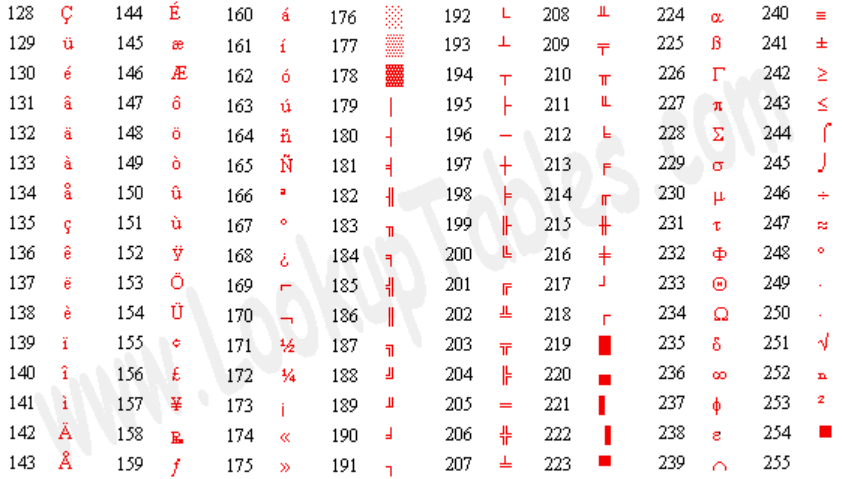

**只求感性理解，严谨解释请参照相关标准！**

这个概念很广，广到整个宇宙。

对于宇宙，还没有确切的认识；拿太阳系来说，上帝让太阳这颗恒星居于“中心”，围绕它以椭圆轨道公转的叫行星。
这里的码，就是太阳和行星；这里的编，就是太阳据于行星椭圆公转轨道的一个焦点。

写文章，也是编码。就是用文字这个码，按照文法编写出来。

打麻将也是编码，就是按照麻将的游戏规则把麻将块编出来。

现在，不扯别的，咱聚焦在“字符串”编码。

字符、串，对的，就是把字符，串起来。

# ASCII

根据计算机发展的客观事实来看，自然首先支持英语（美国人发明的现代计算机）。

英文的符号，有哪些呢？

- 字母（大小写）：a到z、A到Z，共52个。
- 数字：0到9，共10个。
- 常用符号：`` `,.:?;<>!@#$%^&*()[]{}'"\ /~+-=|``，共32个。
- 控制符号：回车、换行、振铃等。
- 印刷符号：制表符等。

插一句，大家知道上述字母、数字、常用符号（数学和标点）是英语书写所必须的，为啥还要有控制符号和印刷符号呢？

    保存在计算机中的信息，如果要展示到显示器上让人直观的读写。
    按照目前主流从左到右、从上到下的习惯，比如当前行到最右边，就要新起一行接着写；比如这一屏到最下面了，就要将换一屏。
    要删除光标之前或之后的字符；要移动光标到某个位置进行插入、删除或修改。
    显示器完成了某一次的显示动作，可以接收下一次的显示内容。
    这些都需要控制符号来表示。

    保存在计算机种的信息，如果要打印到纸张上。
    同样要控制当前行印刷完否，要把纸张往上提一行、把墨盒移动动到最左边接着往右走；
    这一页印刷完否，要换纸张；
    全部印刷完否，设备要停机，甚至发出“嘀嘀”声通知下人。
    这些也需要控制符号来表示。

    人在纸上画方格子（表），是最常用的一种组织结构，从练字本到记账本。
    思考下方格子有几个最基本的符号呢？
    不同人设计，有不同的答案。
    至少有了水平线（-）、垂直线（|），就可以。

总之，一开始，给所有要支持的符号列了一个清单、并像梁山好汉一样排了座次，称之为ASCII（American Standard Code for Information Interchange）表，即“美国信息交换标准编码”。

一起来看看这张表，这一次，保留英文解释，自行求助翻译工具理解！

|   Bin   | Hex  |	Dec | 符号 | 解释 |
|:-------:|-----:|-----:|:--------------|:-------------|
| 00000000 |	0x00 |	0	| NUL           | NULL-Symbol. Primarily used to mark sections in data streams. Usually has no effect. |
| 00000001 |	0x01 |	1	| SOH           | Start Of Heading - First symbol of a messages' headline. |
| 00000010 |	0x02 |	2	| STX           | Start Of Text - First symbol of a messages' text (and the last of a headline). |
| 00000011 |	0x03 |	3	| ETX           | End Of Text. |
| 00000100 |	0x04 |	4	| EOT           | End Of Transmission. |
| 00000101 |	0x05 |	5	| ENQ           | Enquiry - Marks, that a response is requested. |
| 00000110 |	0x06 |	6	| ACK           | Acknowledgment - Hint, that receiver received message. |
| 00000111 |	0x07 |	7	| BEL           | Ring / Bell (from the good old teletypewriter days). |
| 00001000 |	0x08 |	8	| BS            | Backspace. |
| 00001001 |	0x09 |	9	| TAB (HT)	    | Tabulator. |
| 00001010 |	0x0a |	10	| LF            | Line Feed - keep horizontalspacing in next line. |
| 00001011 |	0x0b |	11	| VT            | vertical tabulator. |
| 00001100 |	0x0c |	12	| FF            | Form Feed - Sets cursor to tabulator of a previous line. |
| 00001101 |	0x0d |	13	| CR            | Carriage Return - Removes all tabulators and sets cursor to the first position in the line. |
| 00001110 |	0x0e | 	14	| SO            ||
| 00001111 |	0x0f |	15	| SI            ||
| 00010000 |	0x10 |	16	| DLE           ||
| 00010001 |	0x11 |	17	| DC1           ||
| 00010010 |	0x12 |	18	| DC2           ||
| 00010011 |	0x13 |	19	| DC3           ||
| 00010100 |	0x14 |	20	| DC4           ||
| 00010101 |	0x15 |	21	| NAK           | Negative Acknowlegdement - Receiver gives a negative response. |
| 00010110 |	0x16 |	22	| SYN           ||
| 00010111 |	0x17 |	23	| ETB           | End Of Transmission Block. |
| 00011000 |	0x18 |	24	| CAN           | Cancel. |
| 00011001 |	0x19 |	25	| EM            | End Of Medium |
| 00011010 |	0x1a |	26	| SUB           | Substitute. |
| 00011011 |	0x1b |	27	| ESC           | Escape. |
| 00011100 |	0x1c |	28	| FS            | File Seperator. |
| 00011101 |	0x1d |	29	| GS            | Group Separator. |
| 00011110 |	0x1e |	30	| RS            | Record Seperator. |
| 00011111 |	0x1f |	31	| US            | Unit Seperator. |
| 00100000 |	0x20 |	32	| SP            | Space symbol. |
| 00100001 |	0x21 |	33	| !             ||
| 00100010 |	0x22 |	34	| "             ||
| 00100011 |	0x23 |	35	| #             ||
| 00100100 |	0x24 |	36	| $             ||
| 00100101 |	0x25 |	37	| %             ||
| 00100110 |	0x26 |	38	| &             | ampersand. |
| 00100111 |	0x27 |	39	| '             ||
| 00101000 |	0x28 |	40	| (             ||
| 00101001 |	0x29 |	41	| )             ||
| 00101010 |	0x2a |	42	| *             | The legendary symbol number 42 (" * " is can be placeholder for any symbol). |
| 00101011 |	0x2b |	43	| +             ||
| 00101100 |	0x2c |	44	| ,             ||
| 00101101 |	0x2d |	45	| -             ||
| 00101110 |	0x2e |	46	| .             ||
| 00101111 |	0x2f |	47	| /             ||
| 00110000 |	0x30 |	48	| 0             ||
| 00110001 |	0x31 |	49	| 1             ||
| 00110010 |	0x32 |	50	| 2             ||
| 00110011 |	0x33 |	51	| 3             ||
| 00110100 |	0x34 |	52	| 4             ||
| 00110101 |	0x35 |	53	| 5             ||
| 00110110 |	0x36 |	54	| 6             ||
| 00110111 |	0x37 |	55	| 7             ||
| 00111000 |	0x38 |	56	| 8             ||
| 00111001 |	0x39 |	57	| 9             ||
| 00111010 |	0x3a |	58	| :             ||
| 00111011 |	0x3b |	59	| ;             ||
| 00111100 |	0x3c |	60	| <             ||
| 00111101 |	0x3d |	61	| =             ||
| 00111110 |	0x3e |	62	| >             ||
| 00111111 |	0x3f |	63	| ?             ||
| 01000000 |	0x40 |	64	| @             ||
| 01000001 |	0x41 |	65	| A             ||
| 01000010 |	0x42 |	66	| B             ||
| 01000011 |	0x43 |	67	| C             ||
| 01000100 |	0x44 |	68	| D             ||
| 01000101 |	0x45 |	69	| E             ||
| 01000110 |	0x46 |	70	| F             ||
| 01000111 |	0x47 |	71	| G             ||
| 01001000 |	0x48 |	72	| H             ||
| 01001001 |	0x49 |	73	| I             ||
| 01001010 |	0x4a |	74	| J             ||
| 01001011 |	0x4b |	75	| K             ||
| 01001100 |	0x4c |	76	| L             ||
| 01001101 |	0x4d |	77	| M             ||
| 01001110 |	0x4e |	78	| N             ||
| 01001111 |	0x4f |	79	| O             ||
| 01010000 |	0x50 |	80	| P             ||
| 01010001 |	0x51 |	81	| Q             ||
| 01010010 |	0x52 |	82	| R             ||
| 01010011 |	0x53 |	83	| S             ||
| 01010100 |	0x54 |	84	| T             ||
| 01010101 |	0x55 |	85	| U             ||
| 01010110 |	0x56 |	86	| V             ||
| 01010111 |	0x57 |	87	| W             ||
| 01011000 |	0x58 |	88	| X             ||
| 01011001 |	0x59 |	89	| Y             ||
| 01011010 |	0x5a |	90	| Z             ||
| 01011011 |	0x5b |	91	| [             ||
| 01011100 |	0x5c |	92	| \             | Backslash. |
| 01011101 |	0x5d |	93	| ]             ||
| 01011110 |	0x5e |	94	| ^             ||
| 01011111 |	0x5f |	95	| _             | Underscore. |
| 01100000 |	0x60 |	96	| `             ||
| 01100001 |	0x61 |	97	| a             ||
| 01100010 |	0x62 |	98	| b             ||
| 01100011 |	0x63 |	99	| c             ||
| 01100100 |	0x64 |	100	| d             ||
| 01100101 |	0x65 |	101	| e             ||
| 01100110 |	0x66 |	102	| f             ||
| 01100111 |	0x67 |	103	| g             ||
| 01101000 |	0x68 |	104	| h             ||
| 01101001 |	0x69 |	105	| i             ||
| 01101010 |	0x6a |	106	| j             ||
| 01101011 |	0x6b |	107	| k             ||
| 01101100 |	0x6c |	108	| l             ||
| 01101101 |	0x6d |	109	| m             ||
| 01101110 |	0x6e |	110	| n             ||
| 01101111 |	0x6f |	111	| o             ||
| 01110000 |	0x70 |	112	| p             ||
| 01110001 |	0x71 |	113	| q             ||
| 01110010 |	0x72 |	114	| r             ||
| 01110011 |	0x73 |	115	| s             ||
| 01110100 |	0x74 |	116	| t             ||
| 01110101 |	0x75 |	117	| u             ||
| 01110110 |	0x76 |	118	| v             ||
| 01110111 |	0x77 |	119	| w             ||
| 01111000 |	0x78 |	120	| x             ||
| 01111001 |	0x79 |	121	| y             ||
| 01111010 |	0x7a |	122	| z             ||
| 01111011 |	0x7b |	123	| {             ||
| 01111100 |	0x7c |	124	| |             ||
| 01111101 |	0x7d |	125	| }             ||
| 01111110 |	0x7e |	126	| ~             | Tilde. |
| 01111111 |	0x7f |	127	| DEL           | Delete. |

也就是说，通过这张表，把英语字符和数字对应了起来，这样，计算机就可以存储、处理、显示英语符号代表的现实意义。

    比如“ABC”这个文本，就保存为“0x41 0x42 0x43”三个码。
    比如“123”这个文本（读作“一二三”），就保存为“0x31 0x32 0x33”这三个码。
    但是“123”这个数字（读作“一百二十三”），是如何保存的呢？肯定不能和上边表示的一样，否则就没法区分文本的“123”和数字的“123”了，这个后边说。

学习过二进制、十六进制、十进制甚至八进制的互转，很显然，在ASCII中，编号最大是127（十进制数），也就是7位二进制数能表示的最大自然数。

# Extend ASCII

这个码表用了几天，发现缺陷很多，最棘手的莫过于各种数学公式要用的符号（好多都是希腊字母）、印刷效果惨不忍睹。
因此，进行首次扩展，叫作“Extended ASCII Codes”，即“扩展ASCII编码”，往往也简称为“扩展编码”。

    为了排版美观，防止符号挨得太紧以致黏在一起不便阅读甚至造成歧义，在打印每个符号时会在四周留白；
    所以，仅用水平线和垂直线造的表格，交叉部分会有空隙，看起来方格子（严格说是矩形框）不那么严丝合缝。
    所以再加上四个拐角；索性再加上十字、T形及其倒置或左右九十度旋转，空心的，构造丰富的表格。
    把大于等于、小于等于、约等于，再也不用写成丑陋的“>=”、“<=”、“~=”；
    把开方等略微高级却很常用的运算符号也编进去；
    把西格玛、欧米伽等数学或单位符号也编进去；
    把实心方框、虚心方框、半心方框也加进来。
    诸如此类，进一步丰富了计算机可表达的符号。



这张表呢，最大编码上升到255（十进制数），即8位二进制数能表示的最大自然数。

到这个时候，美国工程师很自豪地宣布，俺造了一张表，该表罗列的符号足够让机器理解咱美国话，只要俺用美国话跟机器发号施令，机器必照办不误。

基于此表，工程师开始理论总结，以让更多人学会使用计算机。

# 字节

既然咱美国话的任意一个符号（文字），都可以用一个8位（bit）二进制数表示，那么，就把8个比特（就是bit的音译）叫作一个“字节（byte）”。

因为这些符号是美国话的最基本元素，则“字节”便是老美设计的计算机的基本存储单位。

那么美国话的字符串，不就是连续的字节存储单元么。

# 别的国家也要一起玩

计算机一经问世，好评如潮。
说各种地球方言的人，都认识到这东西的巨大潜力，落后就要挨打，不想挨打都要搞自己的计算机。

## 欧洲

率先传入欧洲，一方面因为欧美关系好、一方面是欧美文化水平差距不是很悬殊。
希腊之前跟着仙人沾了点儿光，基本字母都被扩展码支持啦，仍要补全未被支持的符号。
欧洲方言众多，大部分起源于叫“拉丁文”的一组符号。
反正远远超过256个（八位二进制最大容量）符号！
再扩展呗，八位不够，十六位、三十二位……

## 中（港澳台新）日韩

东亚也要搞计算机，这些符号多了去了，且不论日韩自造的，仅汉字就有繁体、简体的区别。
同样的手段，扩展！

拿咱中国大陆来说：

组织人手把最常用的符号总结了下，第一批梳理出小七千个，肯定八位二进制（最多256个）不够表达、十六位二进制（最多65536）足够表达。

- GB 2312 - 1980

随后再撸了一次，把疏漏的和之前认为不紧急的符号都算上，梳理出两万多个，十六位二进制依然够表达。

- GBK - 1995

上述GB2312/GBK就是表示这两次梳理的编码国标名称。

## 其余国家和地区

扩展！

# 困扰

有一回，一个中国人把自己写好的文件发送给身在美国打工的发小，对方一脸茫然。
问题出在哪儿？

    假设，中国人把汉字“好”编码为“9527”，也就是“0010 0101 0011 0111”；
    到了美国，美国机器按扩展码识别，也就是“0010 0101”和“0011 0111”，即“37”和“55”；
    小于128肯定都在ASCII表中，查表得知对应的是“%”和“7”；
    美国电报邮递员给发小说“有位中国朋友拍过来一个‘%7’、签收吧”。

    这个“%7”是什么鬼？
    幸亏还不是啥暗号！
    按“零点七折”卖掉？
    只留百分之七的活口？

    天呐，细思极恐。

为了解决此类麻烦，地球村按惯例，搞个组织来统一大家的行动。
涉及到国际标准，自然由ISO牵头。

# Unicode

这回玩儿得大！这个ISO出手不仅要把全世界现有的文字符号都编码起来，还允许后发现和新创造出来的符号加入表中，相当于给计算机提供一个世界大字典。
取了个很屌的名字“Unicode”，“code”就是“编码”，这个“Uni”大有来头：

- Unified：统一的
- Unique：唯一的

狂不狂！

原理很简单，就是把各种语言文字都梳理出来：

    美国是老大（加上好多机器都生米煮成熟饭地默认支持美国编码了），前256个坑继续让ASCII及其Extend码占着；
    剩下的语言文字，一个区段一个区段地排开。

    正因如此，英语是当今世界最通用的语言，没有之一，就连机器的母语都是英语！

比如用六十四位二进制表达全世界的、曾经的、现在的、以后的所有可能的符号，最多可以容纳“18446744073709551616”个，大概是“千亿亿”的级别，货真价实的天文量。
人类目前能想象到的，应该足够了。

那么英文字母在Unicode中的编码就成了：

|字母|ASCII|Unicode|
|:--:|:---:|:---:|
|a| 01100001 | 00000000 00000000 00000000 01100001 |
|b| 01100010 | 00000000 00000000 00000000 01100010 |
|c| 01100011 | 00000000 00000000 00000000 00000011 |

一个美国人给一个英国人拍了一封电报：

    i am ok.

给亲朋好友报平安，人之常情。

大家知道，按之前的ASCII的话，就是：

    0x69 0x20 0x61 0x6d 0x20 0x6f 0x6b 0x2e

其中“0x20”就是“空格”的编码，总共8个字节，连标点符号在内。

一个字节收费0.1美分，一共0.8美分，搞定。

改革之后，同样的电报，按照Unicode的话，成了：

    0x00000069 0x00000020 0x00000061 0x0000006d 0x00000020 0x0000006f 0x0000006b 0x0000002e

一共32个字节，收费3.2美分！

人家当然不愿意干了，坚持给0.8美分，因为之前一直都是这么算的。

电报站说都是熟人，少收个一两个字节的钱可以，少太多都赔钱了。

电报局当然也不愿意干了，上帝（客户）各种投诉，生意还做不做了？

这事是ISO牵头闹的，当然得找带头的。
这时候ISO的技术人员，冷静的思考了下，嘴角微微上扬。

显然，凡是ASCII符号前边填补的这24位零，都是为了配合Unicode一统天下、方便全人类的宏图大业的。

可以在传输电报的时候，不必传输每个英文符号前冗余的这24位零；还必须让接收方知道这是英文符号，否则又可能发生误会（现在大家都按64位一个字符的套路解释的）。

有戏，这个编码会浪费存储空间（可以压缩）。

## UTF

就是“UCS（Universal Character Set） Transformation Format”，即“Unicode”一种传输（压缩）格式。

- UTF-8（UTF8）
- UTF-16（UTF16）
- UTF-32（UTF32）

其中默认按UTF-8编码处理的编程语言应用很广。

大概理解为，“UTF-N”就是按“N”个比特（位）或“N/8”个字节作为基本单位来编码（解码），真实字符是几个基本单位构成的，就编码（解码）几个基本单位，直到能发送（接收）正确的字符。

这样一来，几个字节刚好足够表达某个字符，就用几个字节，实现了冗余位的压缩。

因此，那位美国人在全世界随便哪个电报站发的电报，在全世界随便哪个电报站都能接收到正确的消息，并且发送的字节数尽可能少、成本尽可能低。

电报站、电报局，大家都开心。

# 计算机编码的本质

数量天然是数量，符号天然是文本！
计算天然算数量，编程天然编文本！

时刻清醒地知道每个符号地字面意义和数学意义。

```
kiwi = 9527 # 从代号名字就让然知道这是代表猕猴桃的数量，这个kiwi既有字面意义也有数学意义。
pitaya = 1314 # 从代号名字就让人知道这是代表火龙果数量，这个pitaya既有字面意义也有数学意义。
fruit = kiwi + pitaya # 水果（现有）数量 = 猕猴桃数量 + 火龙果数量。
# 运算时候用的是数学意义，运算结果的fruit既有数学意义也有字面意义，让人知道是水果的数量。
print("共有",fruit,"个。")
```

因此，人给计算机的每一个符号，都要转换位数量，经过运算后，再转换为符号给人看结果。
