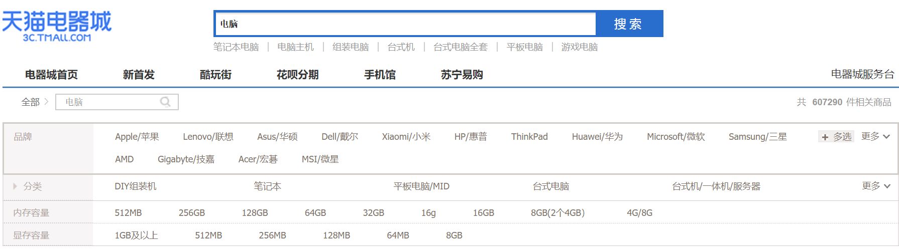
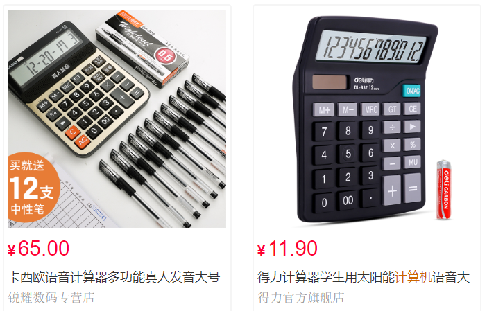
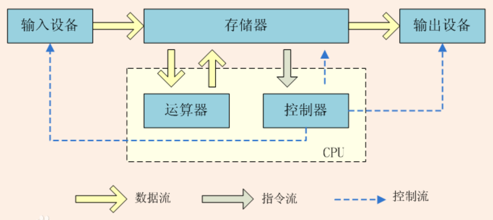

啥是计算机？

乡下人俗称“电脑”。

看到了好多品牌，台式的、笔记本、平板、一体机、组装机，内存、显存这些普通消费者最关心的字眼。

索性再搜索了“计算机”，结果画风如下。

哎呦，这不是老百姓常说的“计算器”么！再搜索了“计算器”，结果画风基本一致。

看来习惯的力量是巨大的，连这种巨型电商都要入乡随俗。

接下来挑几计算机的历史形态唠唠。

# 算盘

中国历史上火了很久的算账工具（和折凳、板砖并列），也一度曾作为新中国数学课必学的内容，甚至在电脑普及后还惊现过“珠心算”热潮。

算盘可理解为五进制兼十进制的计算设备，配合九九乘法口诀，的确爽。

传说玩得厉害的，甚至能用算盘做乘方和开方。

# 现代计算机

曾经有能工巧匠发明过机械计算机。
这里直接走进电气化时代。

又要编故事，这回咱从控制电灯说起。
最原始的电灯控制就是开关，换句话说，这个控制设备计算的就是电灯的亮灭。

手动推闸拉闸，是一种方式。

利用不同结构的电磁现象，制造出各种可用电磁控制的开关：

- 继电器

    主要缺陷是固有的延时，就是从控制端通电到受控端吸合、从控制端断电到受控端弹离（混合机械结构），都有个过程，频率做不高，限制了计算速度（电灯的亮灭速度）。

- 电子管（真空管）

    只需要在每次机器启动时一次性预热，后续通断几乎就是电场反转的速度，很好的解决了继电器的速度限制。
    主要缺陷是做不到很小，寿命短，几乎都工作在非安全电压。

- 晶体管（半导体）

    速度好、低电压、寿命长、体积小。

## 集成电路

基于半导体技术的晶体管，让系统小型化称为可能。
原来占用一百平米普通住宅体积的计算机，缩小到锅盔、烧饼、旺仔小馒头大小的地步；
原来功耗上百千瓦，减少到几十微瓦；
原来每秒数千次加法、数百次乘法，提高到每秒上千万次加法、成百万次乘法。

至此，就当作把电灯控制这个计算玩得更溜了就可以，尽管似乎让电灯亮灭得飞快没啥用。

# 冯诺依曼体系结构

上述主要吹了计算机元器件的革新，还是不明白计算机怎么执行代码的，别急，现在说。

好多计算机大拿都对计算机的设计，提出了各自的意见，对现代计算机影响最大的是以“冯·诺依曼”为代表的想法。
因为老冯提出这个想法（学术成果）是在普林斯顿大学工作期间，因此也叫作“普林斯顿体系结构”。

核心思想就是**存储程序**。

对于纯小白，这个框图理解起来可能有难度，又不得不编故事。

## 小兵张嘎

这小伙子不错，机灵能干有觉悟。

上级与张嘎约定：

- 每天天不亮到县城南门外歪脖子柳树上的鸟窝东半边取出当天要完成的任务；
- 当天天刚黑把当天任务执行的结果放到鸟窝西半边。

某日：

    看下同福客栈的跑堂伙计老白正常上班么？

    正常上班。

次日：

    看下西门大官人最近都往哪儿跑？

    武大郎家。

依此类推。

打个不精确的比方：

- 上级和张嘎组成一个系统（电脑）；
- 张嘎相当于电路板，载有摄像头、拾音器等设备；
- 上级相当于中央处理器（CPU）；
- 鸟窝相当于存储器；
- 输入设备、输出设备均是柳树上的纸笔；

中央处理器控制（控制器）张嘎照令（程序）行事；
程序保存在鸟窝（存储器）；
上级用纸笔写计划（输入设备）；
张嘎用纸笔写结果（输出设备）；
上级根据张嘎反馈的结果决定后边的行动（运算器）；

就这样周而复始，整个系统不断地向存储器读出程序、根据运算结果再决定下次要读出的程序；也可能中断，比如张嘎或者上级身份暴露等意外情况（就要事先制定好应对策略），甚至死亡（损毁或断电）。

# 基本单位
